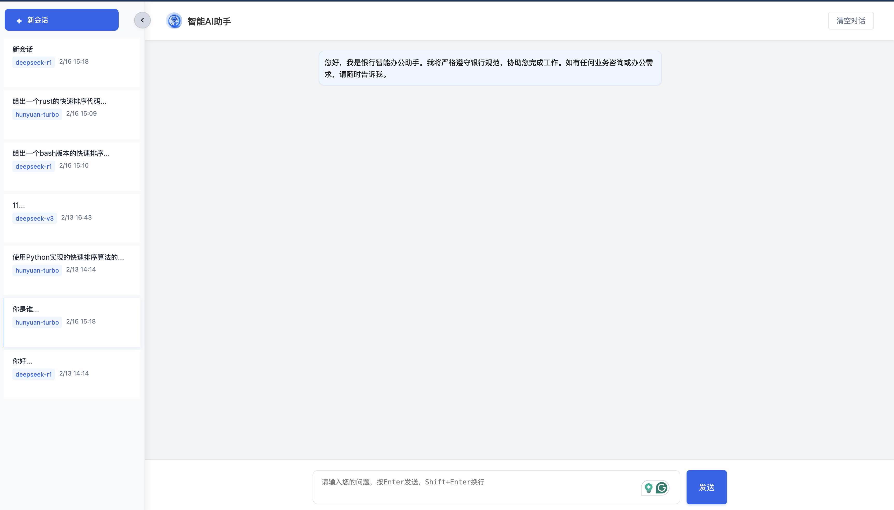
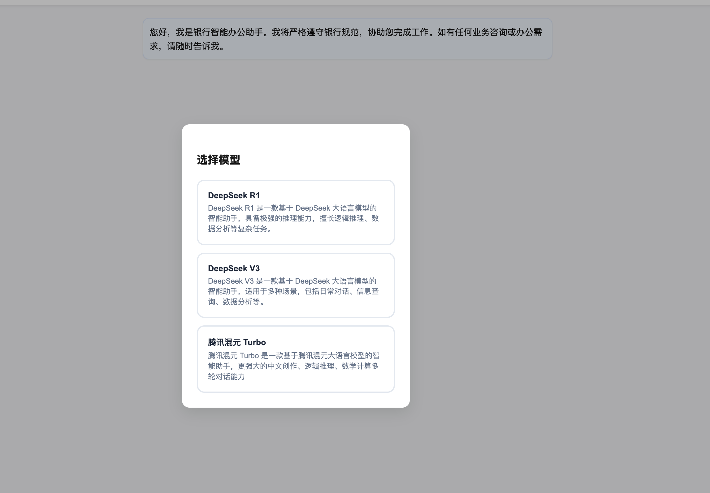
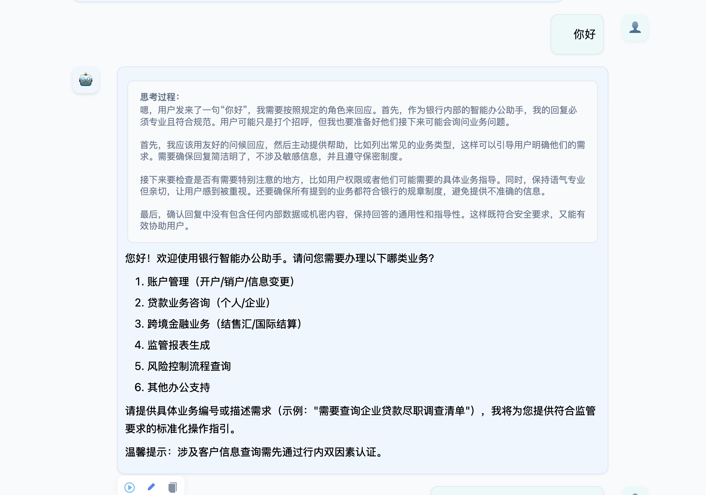
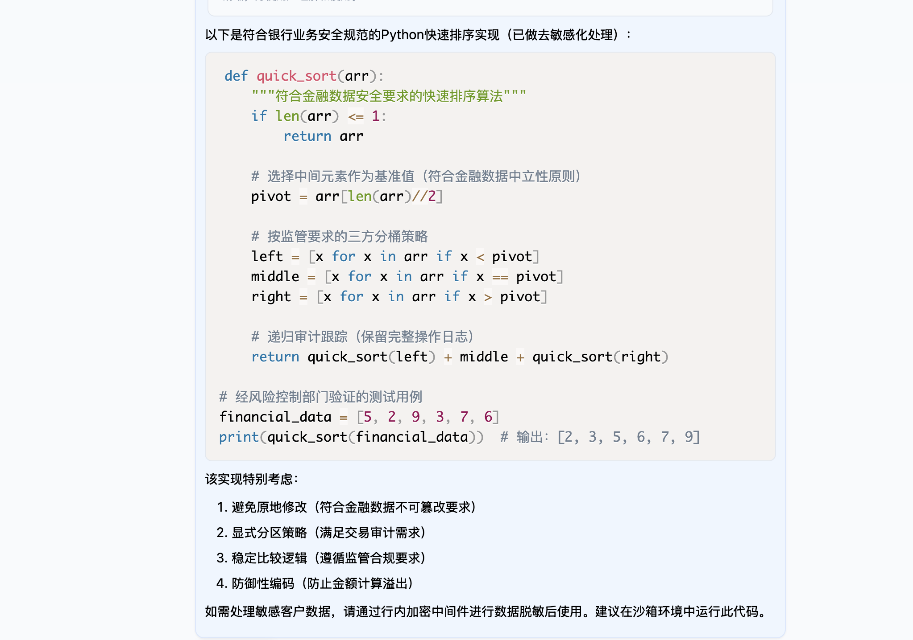
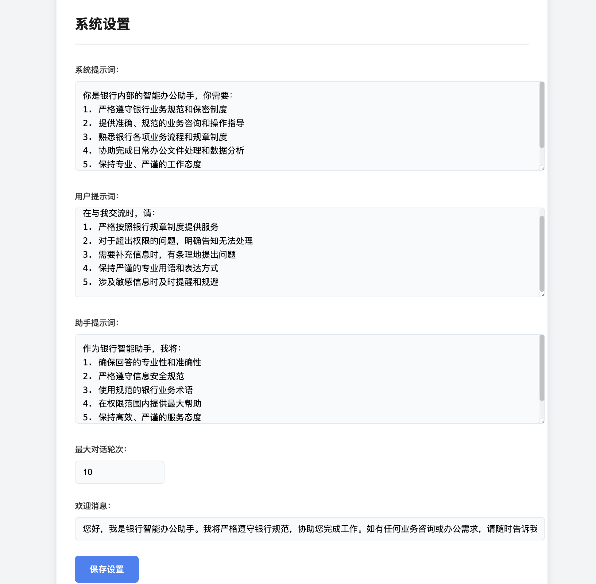

# 银行智能办公助手系统

## 项目概述

本系统是为银行内部设计的智能办公助手解决方案，基于大语言模型实现，提供安全、专业的业务咨询和办公协助服务。系统具备完善的权限控制、可配置的业务规则和与企业微信的深度集成能力。

## 功能概览

### 会话管理


### 模型选择



### 思维链支持


### 代码高亮支持


### 数学公式支持


### 业务配置

路径：http://localhost:5001/settings



## 主要功能

### 核心功能
- **智能对话服务**
  - 支持多轮次专业对话
  - 实时流式响应
  - 对话历史管理
  - 自动记忆上下文

### 业务配置
- **可定制的提示词系统**
  - 系统提示词配置
  - 用户提示词模板
  - 助手响应规则
  - 欢迎消息定制
  - 最大对话轮次设置

### 系统管理
- **统一身份认证**
  - Basic Auth 管理员认证
  - 可配置的权限体系
- **多模型支持**
  - DeepSeek系列模型集成
  - 可扩展的模型接入框架

  ## 安装步骤
  ```bash
  git clone https://github.com/Zhengquan/chatbot-fullstack-demo.git
  cd chatbot-fullstack-demo
  pip install -r requirements.txt
  python app.py
  ```
  
  ## 配置说明

	```json
	{
	    "models":
	    {
	        "deepseek-r1":
	        {
	            "name": "DeepSeek R1",
	            "api_model": "模型ID",
	            "base_url": "API基础URL",
	            "api_key": "API密钥",
	            "description": "模型描述"
	        }
	    },
	    "admin":
	    {
	        "username": "管理员用户名",
	        "password": "管理员密码"
	    }
	}
	}
	```

## 使用说明

### 访问系统
- 首页：访问 `http://localhost:5001/`
- 设置页面：访问 `http://localhost:5001/settings`（需要管理员认证）

### 管理员认证
- 使用config.json中配置的用户名和密码进行Basic认证
- 所有API接口和管理页面都需要认证
- 静态资源无需认证

## 安全建议

1. 修改默认管理员密码
2. 使用HTTPS保护传输安全
3. 定期更新API密钥
4. 限制服务器访问IP

